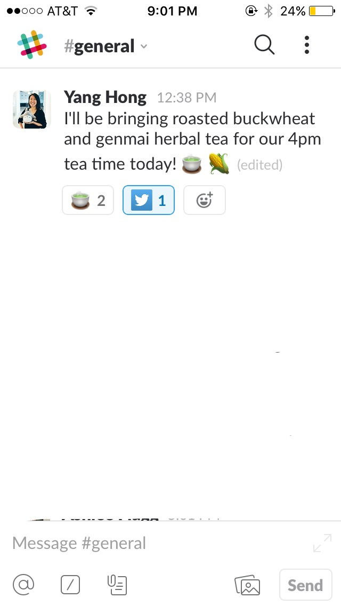
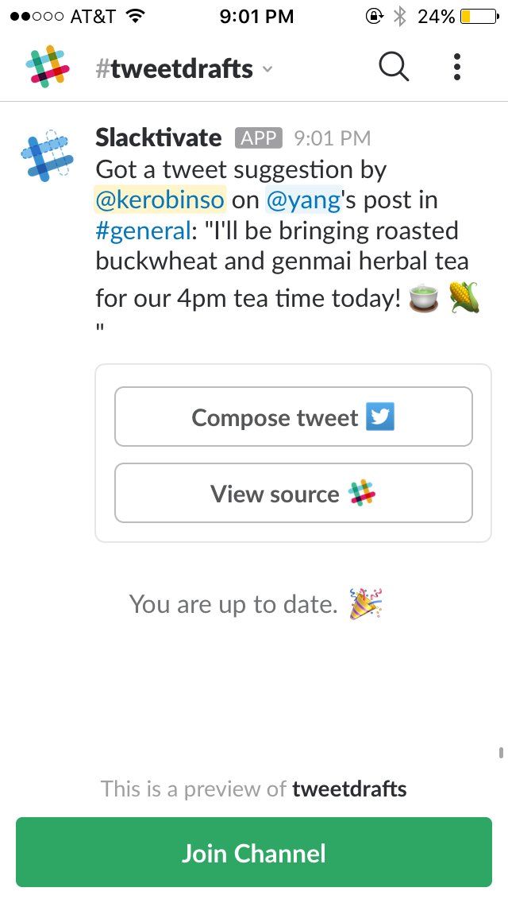
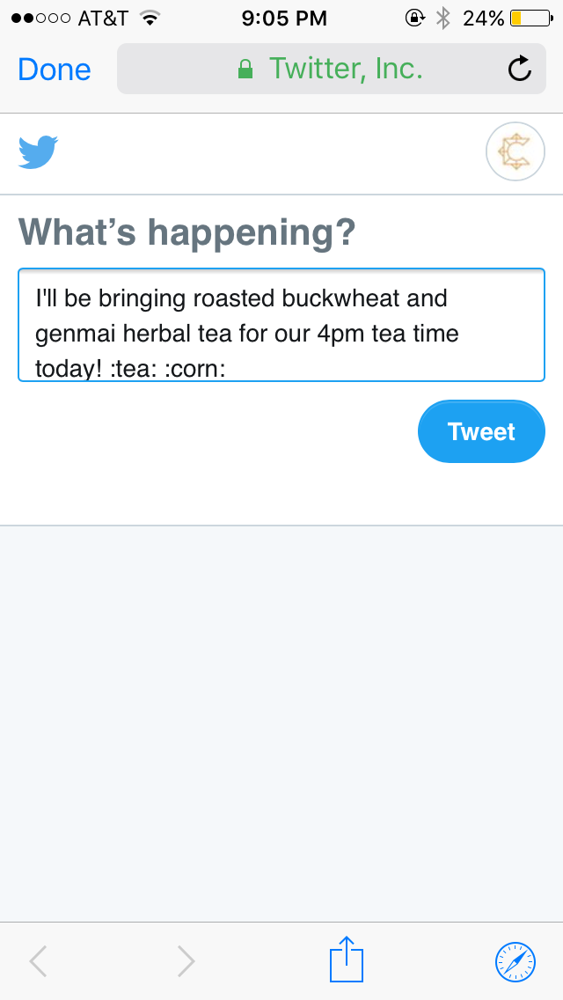
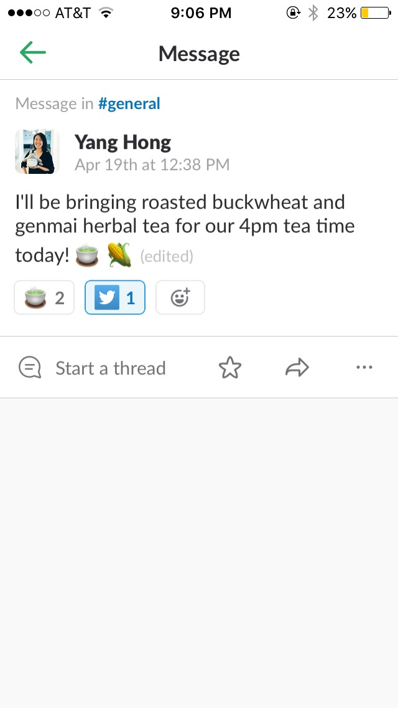
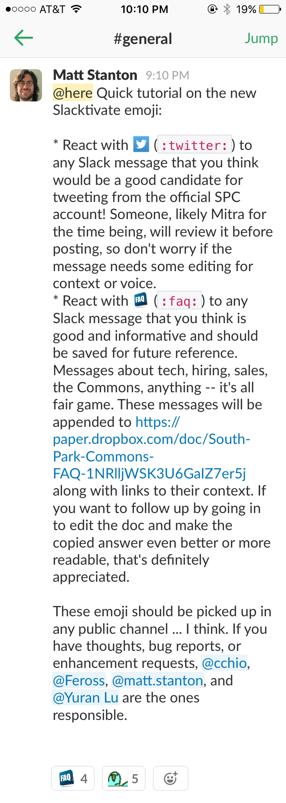
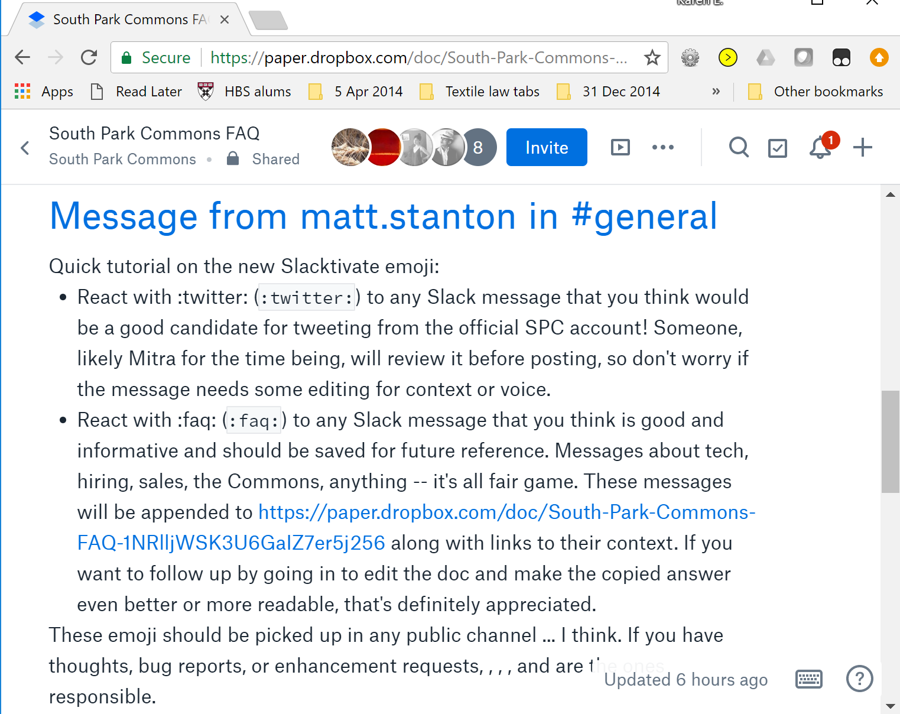

# Slacktivate bot

Pull messages out of SPC Slack based on reactions and put them into more useful places.

## To develop

To get started:
* `virtualenv -p python3 venv`
* `source ./venv/bin/activate`
* `pip install -r requirements.txt`
*    
    ```
    cat > slacktivate.cfg << EOF
    SLACK_TOKEN = "XXXXXX"
    DROPBOX_ACCESS_TOKEN = "YYYYYY"
    SLACK_DOMAIN = "https://ZZZZZZ.slack.com"
    EOF
    ```
* `PORT=5000 SLACKTIVATE_CONFIG=slacktivate.cfg ./start.sh`

You may want ngrok or something similar to serve from your local machine and a test Slack community.

## To deploy

This code is already set up to deploy automatically on [Render](https://render.com) from the `deploy` branch on Github. You should not have
to do anything other than push to that branch during normal usage.

However, if you want to re-deploy the bot to a different server or add capabilities, you may have to edit Slack
permissions or re-authorize the bot on Slack. (Slacktivate is connected in development mode, not packaged as a "real"
production Slack bot would be.) To authorize on Slack:

* Log in to Slack as the bot owner.
* If the bot doesn't own Slacktivate for some reason, go to api.slack.com and tell Slack that you want to build a new app (called Slacktivate, of course.)
* Required features (these may change! please update if you add one):
  * Event subscriptions: `reaction_added`  (You will also have to add and verify the subscription URL. This is https://`APP_DEPLOYMENT_URL`/event .)
  * Permissions: `channels:history`, `channels:read`, `chat:write:bot`, `reactions:read`, `users:read`
* Install the app to the workspace (if it's not there) and add the OAuth token to the `slacktivate.cfg` in deployment.  (For SPC, do this through the Render UI.)
* If you need to enable Dropbox auth: go to https://www.dropbox.com/developers/apps/create and create a new Dropbox API app with full access. Click "generate access token" on the app's config page and add that to `slacktivate.cfg` on Render.

## Example Behavior

Users invoke the slactivate bot by adding a :twitter: emoji or a :faq: emoji to a comment in slack.  These are custom emojis that can be added to slack.  

Here's what the twitter emoji does: it creates a draft tweet in a separate slack channel #tweet-drafts.  Then the user can click a button there to have a tweet draft created in twitter in their browser, ready to be edited and tweeted.

&nbsp;&nbsp;&nbsp;&nbsp;&nbsp;&nbsp;

Similarly, the :faq: emoji invokes an external response.  In this case the response is to add the info from the slack comment to a faq doc, in this case in our Dropbox paper doc.

&nbsp;&nbsp;
